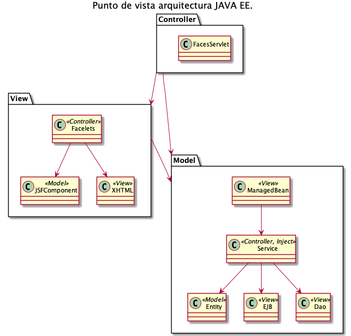
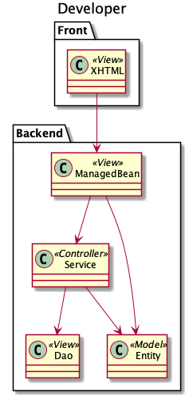
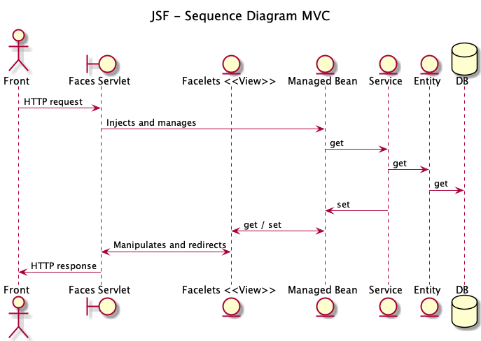

# JSF - JavaServer Faces

JSF es un Framework para aplicaciones Java basadas en web, se formalizó como estándar dentro de la plataforma Jakarta EE.

También es una especificación de Java para crear interfaces de usuario basadas en componentes para aplicaciones web.

Nació en marzo del 2004, el proyecto fue liderado por Craig MCClanahan, creador de Struts.

## Diagrama de clases

## Punto de vista del desarrollador

## Diagrama de secuencia

##Enunciado
Esta práctica pertenece al [Curso de Arquitectura del Software](https://escuela.it/cursos/curso-arquitecturas-software-agiles-pesadas) de EscuelaIT. 

La práctica consiste en diagramar el esquema del estilo arquitectónico que aplica cualquier framework que uses en tu día a día.

Se tiene que realizar el diagrama de clases y diagrama de secuencia que representen la arquitectura del framework que uses habitualmente.

Si estás haciendo el curso con las clases en vivo puedes juntarte con otros estudiantes para definir los diagramas del framework por grupos, si es que otros compañeros usan las mismas herramientas. En este caso puedes informar del framework que vas a utilizar y que otras personas lo sepan y puedan ponerse en contacto contigo para colaborar en la realización de esta práctica. https://msterdedesarr-bs88190.slack.com/archives/C01SX8T9J8L

Los diagramas se debern realizar en PlantUML. <http://www.plantuml.com/>

En el repositorio puedes subir el código que usas para producir los diagramas y las imágenes generadas por la herramienta.
JavaServer Faces